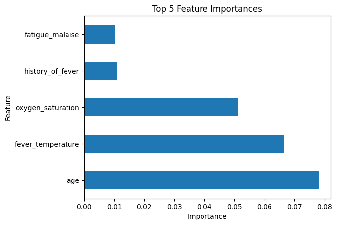
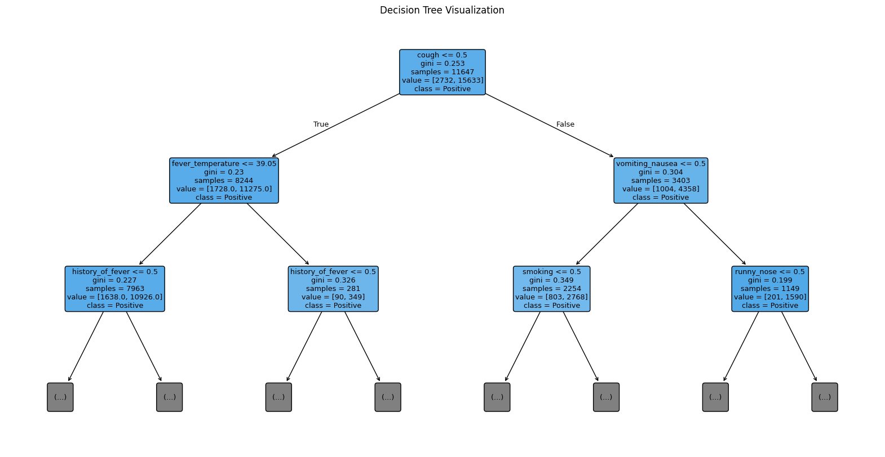
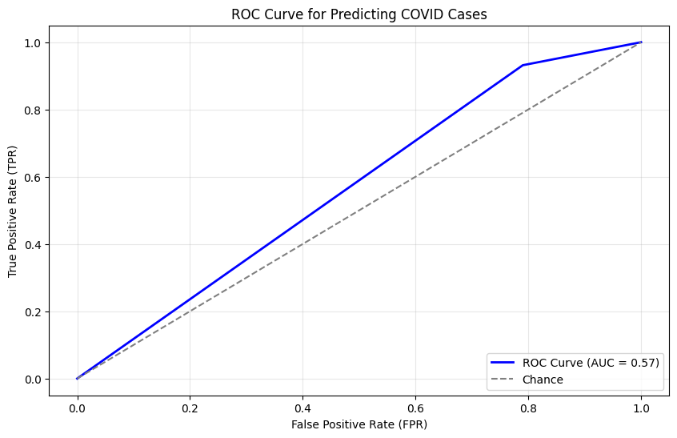

# COVID-19 Patient Status Prediction

This project develops a **machine learning model** to help hospitals rapidly identify COVID-19 positive patients based on clinical and demographic data.  
By predicting infection status early, the system aims to **optimize bed occupancy**, **streamline testing workflows**, and **enable timely isolation and treatment**, supporting hospitals under pandemic pressure.


## 📌 Project Overview

Traditional COVID-19 diagnostics often rely on **manual testing** and **delayed laboratory results**, which can slow down hospital workflows.  
This project leverages **patient-level features** (symptoms, vital signs, demographics) and applies **supervised learning models** to predict COVID-19 infection status.  

Key steps:
- **Exploratory Data Analysis (EDA)** with visualizations
- **Feature preprocessing and scaling**
- **Model training & evaluation** using:
  - Decision Trees
  - Random Forest Classifier
- **Performance metrics**: accuracy, F1 score, ROC curves, confusion matrices
- **Feature importance analysis** to identify the most predictive patient variables

## 📂 Repository Structure
```
.
├── data_processing_covid.ipynb # Main Jupyter notebook (modeling + analysis)
├── README.md # Project documentation
├── requirements.txt # Python dependencies
└── LICENSE # 
```

## ⚙️ Installation

Clone the repository:

```bash
git clone https://github.com/mateluky/covid19-patient-status-prediction.git
cd covid19-patient-status-prediction
```

Install dependencies:

```bash
pip install -r requirements.txt
```

## 🚀 Usage

Open the Jupyter Notebook:
```bash
jupyter notebook data_processing_covid.ipynb
```

Run the cells step by step to:
- Load and preprocess hospital patient data.
- Train decision tree and random forest models.
- Evaluate performance using classification metrics.
- Visualize feature importance and predictive insights.

## 📊 Results

The models were trained and evaluated on patient symptom and demographic data to predict COVID-19 status.

### 🔹 Classification Performance
**Random Forest Classifier**
- Accuracy: **0.85**
- Precision (class 1 / COVID+): **0.86**
- Recall (class 1 / COVID+): **0.99**
- F1 Score (class 1 / COVID+): **0.92**

This shows the model is highly effective at detecting positive cases, minimizing missed diagnoses.

**Decision Tree Classifier**
- Accuracy: **0.82**


### 🔹 Feature Importance
The top predictors identified by the Random Forest model were:

1. **Age**
2. **Fever Temperature**
3. **Oxygen Saturation**
4. **History of Fever**
5. **Fatigue / Malaise**

These align with key clinical indicators of COVID-19 severity.




### 🔹 Decision Tree Visualization
The Decision Tree model highlights how patient features drive predictions, with **cough** and **fever temperature** emerging as critical early splits.




### 🔹 ROC Curve
The ROC curve (AUC = 0.57 in baseline evaluation) illustrates discriminative ability.  
Future improvements such as hyperparameter tuning and cross-validation can help boost this score.




### 🔹 Classification Report (Random Forest)

| Class | Precision | Recall | F1-Score | Support |
|-------|-----------|--------|----------|---------|
| 0 (Negative) | 0.59 | 0.08 | 0.14 | 787 |
| 1 (Positive) | 0.86 | 0.99 | 0.92 | 4461 |
| **Accuracy** |      |      | **0.85** | 5248 |


Overall, the Random Forest model delivers strong recall and F1 performance for detecting COVID-positive cases, making it suitable for hospital triage and screening scenarios.


## 📦 Requirements

Main Python libraries:

- pandas
- numpy
- scikit-learn
- matplotlib
- seaborn

A full list is in [requirements.txt](requirements.txt).


## 📝 License

This project is licensed under the **MIT License** – see the [LICENSE](LICENSE) file for details.


